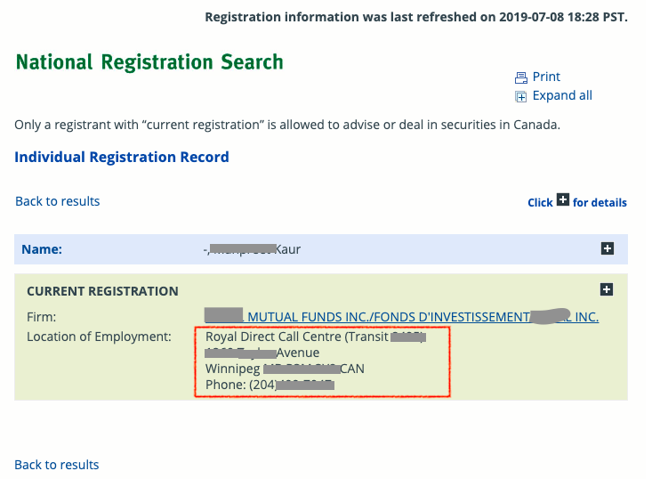

# Web scraping using Selenium with Python (navigating javascript pages & link)

## Web Scraping
Web Scraping is a tool for turning the unstructured data on the web into machine readable, structured data which is ready for analysis.
Using the Python programming language, it is possible to “scrape” data from the web in a quick and efficient manner.

### Complex task with JavaScript links
These days almost all websites use JavaScript links for navigation and to load dynamic stuff. Scraping data from Javascript links make web scraping a bit tricky because the links are dynamic and not static. If you 'Inspect Element' for the link from any Browser it may look something like this:
```
href="javascript:__doPostBack('ctl00$bodyContent$gvIndividuals$ctl02$lbtnIndDetail','')"
```
These links cannot be used directly by your script and read HTML. One way to solve this is to automate the web browser process with Python.

###  <a href='https://pypi.python.org/pypi/selenium'> Selenium</a> can be a life saver
The Selenium package is used to automate web browser interaction from Python. With Selenium, programming a Python script to automate a web browser is possible. Afterwards, those pesky JavaScript links are no longer an issue. Selenium can start a web browser and perform further steps. I have used Firefox.

### Objective of this scraper
To scrape all the search results from this <a href="https://www.securities-administrators.ca/nrs/nrsIndvSearchResults.aspx?mode=AS&type=I&indv=&firm=&juri=ON&ctgy=1&history=0"> Webpage. </a>
Get Name, Firm Name and Firm address details in a CSV. Some screenshots from the webpage that show exactly what we are trying to extract.
 

### Conclusion and Output
My [Python code](/webscrap_CSA.md) scrapes all the information and creates multiple csv files because the data volume is high and also this helps if an error is encountered. Each output CSV file contains 10000 records.
This completes the data extraction process. This process can be extended further to Transform and clean the data for example splitting the address column into Street Address, Phone number, Province etc. Then this clean structured data can be loaded into some other Databases. This process is called <strong>ETL</strong> i.e. <strong> Extract - Transform - Load</strong>..

